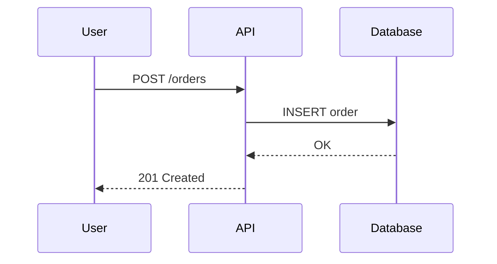
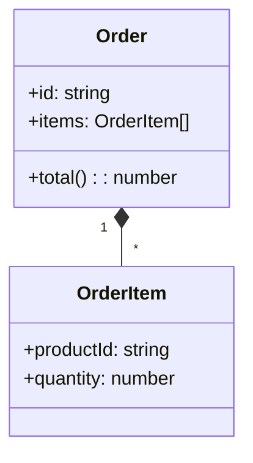

# アーキテクチャドキュメント化ガイド

## 概要

ドキュメントは「書く」ことより「伝える」ことが目的。
読者にとって必要十分な情報を、適切な形式で提供する。

---

## 1. ドキュメントフレームワーク

### arc42 テンプレート

**概要**: 実践的なアーキテクチャドキュメントテンプレート

**12セクション構成**:

| # | セクション | 内容 |
|---|------------|------|
| 1 | Introduction and Goals | システム概要、品質目標、ステークホルダー |
| 2 | Constraints | 技術的・組織的制約 |
| 3 | Context and Scope | システム境界、外部連携 |
| 4 | Solution Strategy | アーキテクチャ方針、技術選定理由 |
| 5 | Building Block View | 静的構造、コンポーネント分割 |
| 6 | Runtime View | 動的振る舞い、シーケンス |
| 7 | Deployment View | インフラ構成、配置 |
| 8 | Crosscutting Concepts | 横断的関心事 |
| 9 | Architecture Decisions | ADR、決定事項 |
| 10 | Quality Requirements | 品質シナリオ |
| 11 | Risks and Technical Debt | リスク、技術的負債 |
| 12 | Glossary | 用語集 |

**適用指針**:
- 全セクション必須ではない
- プロジェクトに応じて取捨選択
- 空のセクションは残さない

---

### 4+1 View Model (Philippe Kruchten)

**5つのビュー**:

| ビュー | 関心事 | 対象読者 |
|--------|--------|----------|
| **Logical** | 機能分割、オブジェクト | 設計者 |
| **Process** | 並行性、同期 | システム統合者 |
| **Development** | モジュール、パッケージ | 開発者 |
| **Physical** | ノード、ネットワーク | 運用者 |
| **Scenarios** (+1) | ユースケース | 全員 |

---

### C4 Model

**4つのレベル**:

```
Level 1: System Context
  └── システムと外部アクター/システムの関係

Level 2: Container
  └── アプリケーション、データベース、ファイルシステム等

Level 3: Component
  └── コンテナ内のコンポーネント（サービス、モジュール）

Level 4: Code
  └── クラス図、詳細設計（必要な場合のみ）
```

**ダイアグラム要素**:
- Person (人物): 青い四角
- Software System: 灰色の四角
- Container: 青い四角（破線）
- Component: 青い四角（実線）
- 関係: 矢印 + ラベル

**利点**:
- 抽象度を明確に分離
- ズームイン/アウトが可能
- 非技術者にも説明しやすい

---

## 2. ADR (Architecture Decision Records)

### 目的

- **なぜ**その決定をしたかを記録
- 将来の開発者への説明
- 意思決定の追跡可能性

### テンプレート

```markdown
# ADR-{番号}: {タイトル}

## Status
Proposed | Accepted | Deprecated | Superseded by ADR-{番号}

## Date
{YYYY-MM-DD}

## Context
- 決定が必要になった背景
- 現状の課題
- 関連する制約条件

## Decision
- 何を決定したか
- 選択した選択肢

## Alternatives Considered

| 選択肢 | メリット | デメリット |
|--------|----------|------------|
| A      | ...      | ...        |
| B      | ...      | ...        |

## Consequences

### Positive
- 良い結果

### Negative
- 悪い結果、受け入れるトレードオフ

### Risks
- リスクと軽減策

## References
- 関連ドキュメント
- 参考資料
```

### ベストプラクティス

- **1 ADR = 1 決定**: 複数の決定を混ぜない
- **不変**: 決定後は編集しない。変更は新ADRで
- **短く**: 1-2ページ以内
- **コードと一緒に管理**: `docs/adr/` または `docs/decisions/`
- **連番**: ADR-001, ADR-002...

---

## 3. RFC (Request for Comments) プロセス

### 目的

- 重要な設計決定の合意形成
- 非同期でのレビュー
- 決定プロセスの透明化

### テンプレート

```markdown
# RFC-{番号}: {タイトル}

## Meta
- **Author**: {名前}
- **Status**: Draft | In Review | Accepted | Rejected
- **Created**: {YYYY-MM-DD}
- **Reviewers**: {名前リスト}
- **Decision Deadline**: {YYYY-MM-DD}

## Summary
{1-3文で概要}

## Motivation
- なぜこの変更が必要か
- 現状の問題点
- 期待される効果

## Detailed Design
{詳細な設計説明}

### API Changes
{該当する場合}

### Data Model Changes
{該当する場合}

### Migration Plan
{該当する場合}

## Alternatives
{検討した他の案}

## Unresolved Questions
{まだ決まっていないこと}

## Future Possibilities
{将来の拡張可能性}
```

### プロセス

1. **Draft**: 著者が RFC を作成
2. **Review Request**: レビュアーを指名
3. **Discussion**: コメント、質問、提案
4. **Revision**: フィードバックを反映
5. **Decision**: 承認 or 却下
6. **Implementation**: 承認後に実装

---

## 4. Living Documentation

### 概要

ドキュメントをコードと同期させ、常に最新の状態を保つ

### 手法

**1. Documentation as Code**
- Markdown でドキュメントを記述
- Git で管理
- CI/CD でビルド・デプロイ

**2. Auto-generated Docs**
- OpenAPI/Swagger: API ドキュメント自動生成
- TypeDoc/JSDoc: コードからドキュメント生成
- Storybook: UIコンポーネントカタログ

**3. Executable Specifications**
- Cucumber/Gherkin: 仕様がそのままテスト
- Doctest: ドキュメント内のコード例を実行

**4. Architecture as Code**
- PlantUML, Mermaid: テキストから図を生成
- Structurizr: C4モデルをコードで定義

---

### Docs as Tests

**概要**: ドキュメントの内容をテストで検証

**例**:
```python
# README.md のコード例が動作することを検証
def test_readme_example():
    # README から抽出したコード
    result = my_function(input)
    assert result == expected
```

---

## 5. ダイアグラム作成

### 推奨ツール

| ツール | 形式 | 特徴 |
|--------|------|------|
| Mermaid | テキスト | Markdown 埋め込み可、GitHub 対応 |
| PlantUML | テキスト | UML 全般、詳細な制御 |
| Structurizr | DSL | C4 モデル専用 |
| draw.io | GUI | 汎用、無料 |
| Figma | GUI | デザイナーと共有しやすい |

### Mermaid 例

**シーケンス図**:


**クラス図**:


---

## 6. ドキュメント管理

### 構成例

```
docs/
├── README.md           # プロジェクト概要
├── architecture/
│   ├── overview.md     # アーキテクチャ概要
│   ├── c4/             # C4 ダイアグラム
│   └── decisions/      # ADR
├── api/
│   ├── openapi.yaml    # API 仕様
│   └── examples/       # リクエスト例
├── guides/
│   ├── getting-started.md
│   ├── development.md
│   └── deployment.md
└── rfcs/               # RFC
```

### 命名規則

- **ADR**: `ADR-001-use-postgresql.md`
- **RFC**: `RFC-001-new-auth-system.md`
- **日付付き**: `2024-01-15-migration-plan.md`

---

## 7. 読者別ドキュメント

| 読者 | 必要な情報 | 形式 |
|------|------------|------|
| **新規開発者** | セットアップ、全体像 | Getting Started, アーキテクチャ概要 |
| **開発者** | API仕様、設計意図 | API Doc, ADR |
| **運用者** | 構成、監視、障害対応 | 運用手順書、Runbook |
| **ステークホルダー** | 進捗、リスク | サマリー、ダッシュボード |

---

## 8. チェックリスト

### 新規プロジェクト

- [ ] README.md を作成（目的、セットアップ、構成）
- [ ] アーキテクチャ概要を作成（C4 Level 1-2）
- [ ] ADR プロセスを確立
- [ ] API ドキュメント自動生成を設定
- [ ] 用語集を作成

### ADR 作成時

- [ ] 背景は十分に説明されているか？
- [ ] 検討した代替案は記載されているか？
- [ ] トレードオフは明示されているか？
- [ ] ステータスは正しいか？

### ドキュメントレビュー

- [ ] 対象読者は明確か？
- [ ] 最新の状態か？（古い情報はないか）
- [ ] 図と文章は整合しているか？
- [ ] 用語は一貫しているか？
- [ ] リンク切れはないか？

### 継続的改善

- [ ] ドキュメントは定期的に見直されているか？
- [ ] 自動生成できる部分は自動化されているか？
- [ ] ドキュメントの品質をCIでチェックしているか？

---

## 9. テンプレート

### README.md テンプレート

```markdown
# {プロジェクト名}

{1-2文の説明}

## 主な機能
- {機能1}
- {機能2}

## 技術スタック
- {技術1}
- {技術2}

## セットアップ

### 前提条件
- {前提1}

### インストール
\`\`\`bash
{コマンド}
\`\`\`

## 開発

### ローカル起動
\`\`\`bash
{コマンド}
\`\`\`

### テスト
\`\`\`bash
{コマンド}
\`\`\`

## アーキテクチャ
{簡単な説明 + 図へのリンク}

## ドキュメント
- [API仕様](./docs/api/)
- [アーキテクチャ決定](./docs/decisions/)

## ライセンス
{ライセンス}
```

### 運用手順書テンプレート

```markdown
# {手順名}

## 概要
{この手順で何を行うか}

## 前提条件
- [ ] {条件1}
- [ ] {条件2}

## 手順

### 1. {ステップ名}
{説明}
\`\`\`bash
{コマンド}
\`\`\`
期待される結果: {結果}

### 2. {ステップ名}
...

## 確認方法
{成功の確認方法}

## ロールバック
{問題発生時の戻し方}

## トラブルシューティング

### {エラー1}
原因: {原因}
対処: {対処}
```

