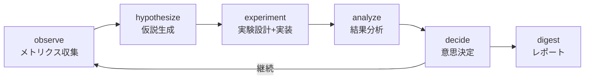

# Spec Research - AI プロダクト研究ループ

## 概要

デプロイ後のプロダクトを継続的に改善する自律研究ループ。
メトリクスから仮説を生成し、実験を設計・実装・分析し、改善を提案する。

既存スキルを**オーケストレーション**して動作する（新規ロジック実装なし）。

## コマンド

| コマンド | 目的 |
|---------|------|
| `/spec research run` | 全フェーズ自動実行（夜間バッチ用） |
| `/spec research observe` | メトリクス収集・異常検知 |
| `/spec research hypothesize` | データから仮説生成 |
| `/spec research experiment` | 実験設計→/spec plan→/spec go |
| `/spec research analyze` | 実験結果分析 |
| `/spec research decide` | 意思決定（自動 or decision-queue） |
| `/spec research digest` | Morning Digest 生成・Slack通知 |
| `/spec research journal` | Experiment Journal 閲覧・更新 |
| `/spec research status` | 研究ループ全体の状態確認 |

## ワークフロー



## ディレクトリ構造

```
research/
├── observations.md              # 最新の観察結果
├── hypotheses.md                 # 仮説一覧（ICEスコア付き）
├── decision-queue.json           # 人間待ちの意思決定
├── experiment-journal.md         # 全実験の累積記録
├── digests/
│   └── {date}.md                 # Morning Digest
└── experiments/
    └── {name}/
        ├── experiment.yaml       # 実験定義
        ├── analysis.md           # 分析結果
        └── code-tour.json        # コードツアー
```

## 既存スキル活用マップ

| フェーズ | 既存スキル |
|---------|-----------|
| observe | `mcp-worker`(GitHub/Slack), `xlsx`(データ集約), `WebFetch`(ダッシュボード) |
| hypothesize | `paper-analysis`(方法論), `spec-verify-matrix`(ヒューリスティクス), `WebSearch`(競合) |
| experiment | `/spec plan` + `/spec go`（実験=feature として扱う） |
| analyze | `xlsx`(データ分析), `math-proof`(統計検証), `mcp-worker`(データ取得) |
| decide | `senior-architect`(トレードオフ), `mcp-worker`(Slack通知) |
| digest | `doc-coauthoring`(構造化文書), `mcp-worker`(Slack送信) |

---
詳細: [CLAUDE.md](./CLAUDE.md) | [prompts/research-system.md](./prompts/research-system.md)
