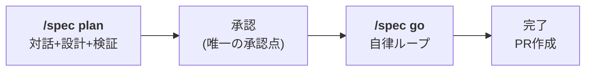
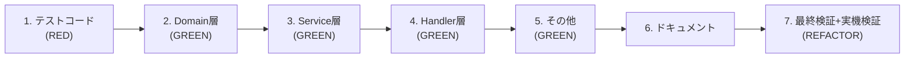
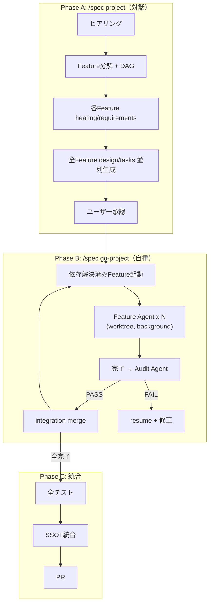

# Spec - 仕様駆動開発スキル

## クイックスタート

```bash
# 初期化（1回のみ）
/spec init-project

# 仕様策定（対話→設計自動生成）
/spec plan {feature} "{要件}"

# 自律実装（止まらずに実装・テスト・修正を繰り返す）
/spec go
```

## 推奨起動モード

`/spec go` の自律ループを止めずに実行するには、適切な権限モードで起動する:

```bash
# 推奨: Auto Mode（安全な自律実行、プロンプトインジェクション保護付き）
claude --permission-mode auto

# 代替: Safe YOLO（コンテナ/VM 内推奨）
claude --dangerously-skip-permissions
```

または settings.json で永続設定:
```json
{ "permissions": { "defaultMode": "auto" } }
```

通常モードで起動した場合、`/spec go` 実行前に `Shift+Tab` で acceptEdits に切り替える。

## ワークフロー



## コマンド

| コマンド | 目的 |
|---------|------|
| `/spec init-project` | プロジェクト初期化（Inception + Discovery + ROADMAP + Backlog） |
| `/spec plan {feature} "{要件}"` | 対話で要件確定 → 設計・タスク・テスト仕様を自動生成 |
| `/spec go` | 自律実装ループ（実装→テスト→修正→繰り返し→PR） |
| `/spec new {feature}` | 新機能開始（個別実行用） |
| `/spec status` | 状態確認 |
| `/spec verify` | lint/test 検証 |
| `/spec complete` | 完了処理（SSOT 更新 + PR 作成） |
| `/spec project "{name}" "{概要}"` | マルチFeatureプロジェクト定義（並列開発） |
| `/spec go-project` | Wave ベース並列実装開始 |
| `/spec project-status` | 全Feature進捗表示 |
| `/spec backlog` | Product Backlog 生成 |
| `/spec refine` | Backlog リファインメント |
| `/spec retro {milestone}` | レトロスペクティブ |

## /spec plan の内部フロー（Issue-First + Step-by-Step 検証）

```mermaid
graph LR
    hearing["1. hearing<br/>(5W1H対話)"]
    issue["2. gh issue create<br/>(追跡チケット)"]
    init["3. init-feature<br/>(全テンプレート作成)"]
    hear_w["4. hearing.md<br/>書き出し+検証"]
    req["5. requirements<br/>(UC+受入条件)"]
    explore["6. コードベース調査<br/>Explore x 3 並列"]
    design["7. design.md<br/>Agent(general-purpose)<br/>spec-design-generator"]
    arch["8. arch-check.md<br/>Agent(general-purpose)<br/>senior-architect refs"]
    testask["9-10. test-spec + tasks<br/>Agent(general-purpose)<br/>test-planner + task-decomposer"]
    update["11. Issue更新"]
    branch["12-13. ブランチ+コミット"]
    review["14. ユーザーレビュー"]

    hearing --> issue --> init --> hear_w --> req --> explore --> design --> arch --> testask --> update --> branch --> review
```



各ファイル書き出し後に `verify-artifact.sh` で品質ゲート（存在・サイズ・プレースホルダ残存チェック）。検証パスまで次ステップに進まない。

- `--skip-hearing` で hearing をスキップ可能
- Step 8 の arch-check で FAIL → design.md 修正ループ
- Step 8 は `/senior-architect` スキル、Step 9 は `testing-suite` 系スキルを使用

## /spec go の内部フロー

```
自律ループ（停止条件に該当するまで止まらない）:

  tasks.md からタスク読み取り
  ↓
  TaskCreate × 7（全 Phase を Task 登録）
  ↓
  Agent(Explore) でコードベース調査（3並列以上）
  ↓
  Phase 1: テストコード作成（RED）
    → phase-runner start → 実装 → チェックポイント → phase-runner finish → TaskUpdate
  ↓
  Phase 2-5: 実装（独立タスクは Agent 並列起動）
    → phase-runner start → テスト+lint → 失敗なら修正 → phase-runner finish
    → Phase 境界で CronCreate（検証スケジュール）→ CronDelete
  ↓
  Phase 6: ドキュメント更新
  ↓
  Phase 7: 最終検証 + 実機検証
    → 自動テスト → verification-matrix.md 生成（ヒューリスティクス適用）
    → Frontend: spec-verify-frontend（Playwright + A11y）
    → Backend: spec-verify-backend（API + セキュリティ）
    → verify-report.md → 修正 → phase-runner finish
  ↓
  /spec complete → PR 作成
```

## ディレクトリ構造

```
specs/
├── 00_CONTEXT.md ~ 08_DEV_GUIDELINES.md  # SSOT
├── inception.md, discovery.md            # プロジェクト定義
├── ROADMAP.md, BACKLOG.md                # 計画
├── project-state.json                    # マルチFeature並列開発の状態管理
├── project-guidelines-summary.md         # SSOT抜粋（Feature Agent用）
├── retrospectives/{milestone}.md         # 振り返り
├── templates/config.yaml                 # 設定
├── audit/                                # Audit Agent レポート
│   └── audit-report.md
├── integration/                          # 統合管理
│   └── merge-plan.md
└── features/{issue}-{feature}/           # 作業中（完了後削除）
    ├── hearing.md, requirements.md
    ├── design.md, arch-check.md
    ├── test-spec.md, tasks.md
    ├── issue.md                          # .github/ テンプレート使用
    ├── ssot-updates.md                   # SSOT更新記録（並列開発時）
    └── adr.md                            # Type 1 決定時
```

## 7-Phase 構造



## コミットメッセージ

```
feat:{issue}_Phase{N}_{サマリ}
```

## スクリプト

| スクリプト | 用途 |
|-----------|------|
| `init-project.sh` | config.yaml 作成 |
| `init-feature.sh [issue] <feature>` | テンプレート作成 + 軽量 Issue 自動作成 |
| `phase-runner.sh <feature_dir> <phase> start` | Phase 開始（状態記録） |
| `phase-runner.sh <feature_dir> <phase> finish <summary>` | Phase 完了（commit-phase.sh 呼出 + 状態記録） |
| `check-status.sh` | ワークフロー状態表示 |
| `verify-artifact.sh <feature_dir> <filename> [min_bytes]` | 成果物品質ゲート |
| `parse-dag.sh <roadmap.md> [--waves\|--json\|--mermaid]` | DAG解析 + Wave計算 |
| `project-status.sh [project-state.json] [--json\|--brief]` | マルチFeature進捗表示 |
| `merge-feature.sh <integration> <feature> <name>` | Feature → integration merge |
| `audit-merge-test.sh <base> <test_cmd> <lint_cmd> <branches...>` | 統合テスト（一時ブランチ） |

## マルチFeature並列開発 (`/spec project` + `/spec go-project`)

複数 Feature を Agent Teams + git worktree で並列実装するオーケストレーション。



### アクター

| アクター | Agent 指定 | 用途 |
|---------|-----------|------|
| Feature Agent | `Agent(isolation="worktree", run_in_background=true)` | 1 Feature の Phase 1-7 実装 |
| Audit Agent | `Agent(subagent_type="spec-auditor")` | 横断的品質監査 |
| Design Agent | 既存サブエージェント群 | design/arch-check/test-spec/tasks 生成 |

### ルール

| ルールファイル | 用途 |
|---------------|------|
| `rules/feature-decomposition.md` | Feature 分解基準、依存判定、DAG 定義 |
| `rules/wave-execution.md` | Wave 実行エンジン、スケジューリング、リトライ |
| `rules/audit.md` | Audit チェック項目、判定基準 |
| `rules/integration.md` | merge 戦略、SSOT 統合、PR |

---
詳細: [CLAUDE.md](./CLAUDE.md) | [prompts/spec-system.md](./prompts/spec-system.md)
