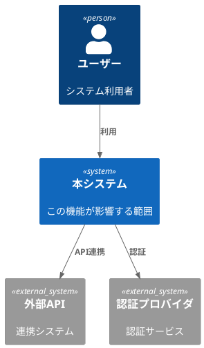
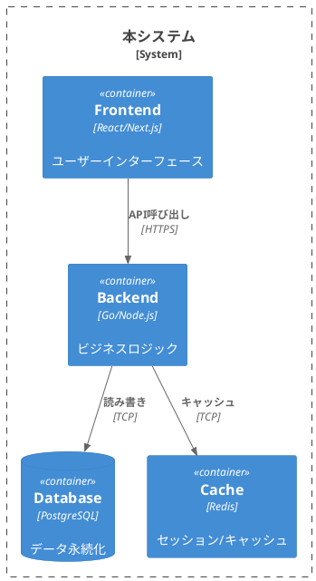
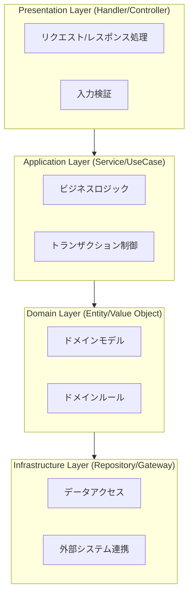
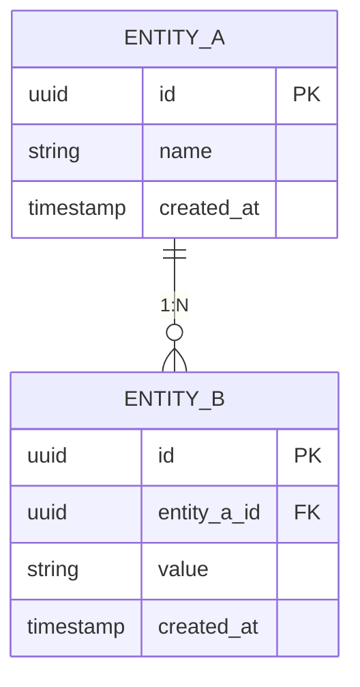

# {{FEATURE_NAME}} - 設計書

**基準文書**: `specs/features/{{FEATURE_SLUG}}/requirements.md`
**作成日**: {{DATE}}
**図ガイドライン**: [diagram-guidelines.md](./diagram-guidelines.md)

---

## 1. 概要

**目的**: [目的を記述]

**スコープ**:
- [スコープ1]
- [スコープ2]

---

## 2. アーキテクチャ（C4 Model）

<!--
図ツール選択:
- クラウドアイコンが必要 → PlantUML + stdlib（AWS/Azure/GCP）
- GitHub表示優先 → Mermaid
- 簡易構成 → ASCII
詳細: diagram-guidelines.md 参照
-->

### 2.1 Context（Level 1）- システム境界

<!-- PlantUML推奨: クラウドベンダーアイコン使用時 -->


**外部連携**:
| 外部システム | 連携方式 | 目的 |
|--------------|----------|------|
| [システム名] | REST API | [目的] |

---

### 2.2 Container（Level 2）- コンテナ構成

<!-- クラウドベンダー別アイコン: diagram-guidelines.md §3 参照 -->


| コンテナ | 技術 | 責務 |
|----------|------|------|
| Frontend | [技術] | [責務] |
| Backend | [技術] | [責務] |
| Database | [技術] | [責務] |

---

### 2.3 Component（Level 3）- コンポーネント設計

**レイヤー構造**:



| レイヤー | ファイル | 責務 |
|----------|----------|------|
| Presentation | `[path]` | [責務] |
| Application | `[path]` | [責務] |
| Domain | `[path]` | [責務] |
| Infrastructure | `[path]` | [責務] |

---

### 2.4 ER 図

<!-- Mermaid推奨: GitHub対応、シンプルな記法 -->


---

## 3. データベーススキーマ

### 3.1 [テーブル名]

```sql
CREATE TABLE xxx (
    id UUID PRIMARY KEY DEFAULT gen_random_uuid(),
    -- カラム定義
    created_at TIMESTAMPTZ NOT NULL DEFAULT CURRENT_TIMESTAMP,
    updated_at TIMESTAMPTZ NOT NULL DEFAULT CURRENT_TIMESTAMP
);

-- インデックス
CREATE INDEX idx_xxx_yyy ON xxx(yyy);

-- 外部キー制約
ALTER TABLE xxx ADD CONSTRAINT fk_xxx_yyy
    FOREIGN KEY (yyy_id) REFERENCES yyy(id);
```

**カラム説明**:
| カラム | 型 | NULL | 説明 |
|--------|-----|------|------|
| id | UUID | NO | 主キー |
| ... | ... | ... | ... |

---

## 4. API 仕様

### 4.1 POST /api/v1/xxx

**概要**: [API の目的]

**認証**: 必要 / 不要

**リクエスト**:
```json
{
  "field": "value"
}
```

**レスポンス (201 Created)**:
```json
{
  "status": "success",
  "data": {
    "id": "..."
  }
}
```

**エラーレスポンス**:
| ステータス | エラーコード | 説明 |
|------------|--------------|------|
| 400 | INVALID_INPUT | 入力値不正 |
| 401 | UNAUTHORIZED | 認証エラー |
| 403 | FORBIDDEN | 権限エラー |
| 404 | NOT_FOUND | リソース未検出 |

---

## 5. セキュリティ設計

### 5.1 認証・認可

| 項目 | 設計 |
|------|------|
| 認証方式 | JWT / Session / OAuth 2.0 |
| 認可方式 | RBAC / ABAC |
| セッション管理 | [詳細] |

### 5.2 データ保護

| 項目 | 対応 |
|------|------|
| 転送中の暗号化 | TLS 1.3 |
| 保存時の暗号化 | AES-256 |
| 機密データ | [マスキング/ハッシュ化対象] |

### 5.3 入力検証

| 入力項目 | 検証内容 |
|----------|----------|
| [フィールド名] | [検証ルール] |

### 5.4 監査ログ

| イベント | ログ内容 |
|----------|----------|
| [イベント] | [記録項目] |

---

## 6. 設計決定（Type 1/Type 2）

### Type 1 決定（不可逆 - ADR 必須）

| 決定事項 | 選択 | 理由 | ADR |
|----------|------|------|-----|
| [決定事項] | [選択内容] | [理由] | [ADR-xxx](./adr.md) |

### Type 2 決定（可逆 - 変更容易）

| 決定事項 | 選択 | 理由 |
|----------|------|------|
| [決定事項] | [選択内容] | [理由] |

---

## 7. テスト戦略

### 7.1 テスト可能性の考慮

| レイヤー | テスト方法 | モック対象 |
|----------|------------|------------|
| Presentation | Integration Test | Service層 |
| Application | Unit Test | Repository |
| Domain | Unit Test | なし |
| Infrastructure | Integration Test | 実DB/外部API |

### 7.2 テストケース概要

| 観点 | テスト内容 |
|------|------------|
| 正常系 | [内容] |
| 異常系 | [内容] |
| 境界値 | [内容] |

---

## 8. 実装戦略

### 8.1 ファイル構成

```
[プロジェクトのディレクトリ構造]
```

### 8.2 依存関係

| ライブラリ | バージョン | 用途 |
|------------|------------|------|
| [名前] | [バージョン] | [用途] |

---

## 9. 関連ドキュメント

- [requirements.md](./requirements.md) - 要件定義書
- [arch-check.md](./arch-check.md) - アーキテクチャチェック
- [adr.md](./adr.md) - 設計決定記録
- [tasks.md](./tasks.md) - タスク一覧
- [diagram-guidelines.md](../diagram-guidelines.md) - 図の選択・生成ガイドライン
