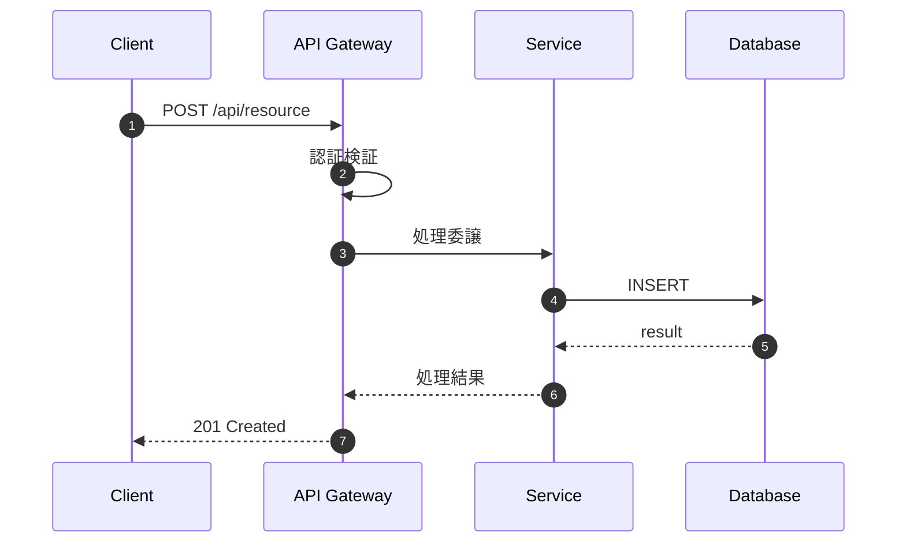
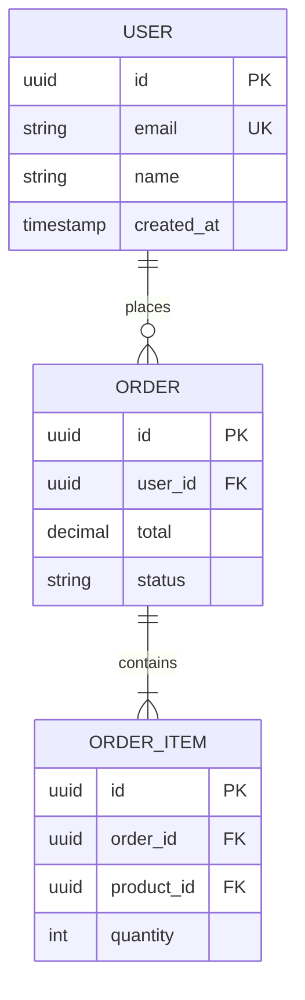
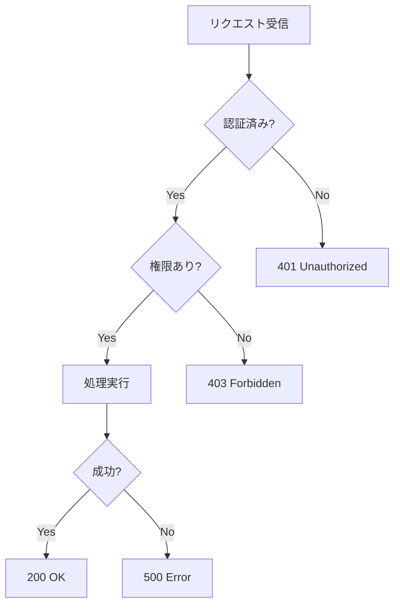
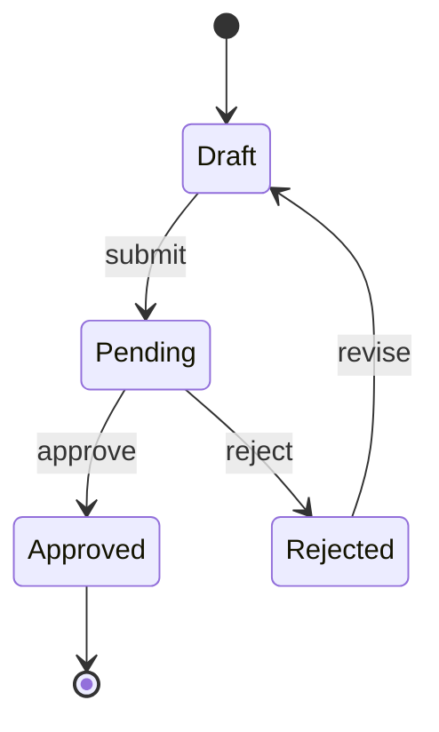

# 図の選択・生成ガイドライン

> 設計意図を視覚的に伝えるための図の選択基準と生成方法。

---

## 1. 図の種類と使い分け

| 記述対象 | 推奨図 | ツール | 使用場面 |
|----------|--------|--------|----------|
| システム全体像 | C4 Context | PlantUML | design.md §2.1 |
| コンポーネント構成 | C4 Container/Component | PlantUML | design.md §2.2-2.3 |
| API呼び出しフロー | Sequence Diagram | Mermaid | 複雑な連携処理 |
| ビジネスロジック | Flowchart | Mermaid | 条件分岐・判断フロー |
| データ構造 | ER Diagram | Mermaid | design.md §2.4 |
| 状態遷移 | State Diagram | Mermaid | ステータス管理 |
| クラス構造 | Class Diagram | Mermaid/PlantUML | ドメインモデル |
| クラウドアーキテクチャ | Architecture Diagram | PlantUML + stdlib | インフラ設計 |

---

## 2. ツール選択基準

| ツール | 強み | 弱み | 推奨用途 |
|--------|------|------|----------|
| **Mermaid** | GitHub対応、シンプル | アイコン非対応 | Sequence, ER, Flowchart |
| **PlantUML** | クラウドアイコン、C4対応 | 記法が複雑 | クラウド構成、C4 Model |
| **ASCII** | ツール不要、軽量 | 表現力に限界 | 簡易レイアウト |

**選択フロー**:
1. クラウドベンダーアイコンが必要 → **PlantUML**
2. C4 Model で描く → **PlantUML + C4-PlantUML**
3. GitHub で直接表示したい → **Mermaid**
4. 簡易的な構成図 → **ASCII** or **Mermaid**

---

## 3. クラウドアーキテクチャ図（PlantUML stdlib）

### 3.1 公式アイコンソース

| ベンダー | stdlib | 公式リポジトリ |
|----------|--------|----------------|
| AWS | `<awslib/...>` | [awslabs/aws-icons-for-plantuml](https://github.com/awslabs/aws-icons-for-plantuml) |
| Azure | `<azure/...>` | [plantuml-stdlib/Azure-PlantUML](https://github.com/plantuml-stdlib/Azure-PlantUML) |
| GCP | `<gcp/...>` | [davidholsgrove/gcp-icons-for-plantuml](https://github.com/davidholsgrove/gcp-icons-for-plantuml) |

### 3.2 AWS アーキテクチャ図

```plantuml
@startuml AWS Architecture
!include <awslib/AWSCommon>
!include <awslib/AWSSimplified>
!include <awslib/Compute/Lambda>
!include <awslib/Database/DynamoDB>
!include <awslib/Storage/S3>
!include <awslib/NetworkingContentDelivery/APIGateway>

skinparam linetype ortho

APIGateway(apigw, "API Gateway", "REST API")
Lambda(lambda, "処理関数", "Node.js 20.x")
DynamoDB(db, "データストア", "On-demand")
S3(bucket, "ファイル保存", "Standard")

apigw --> lambda : invoke
lambda --> db : read/write
lambda --> bucket : upload/download
@enduml
```

### 3.3 Azure アーキテクチャ図

```plantuml
@startuml Azure Architecture
!include <azure/AzureCommon>
!include <azure/Compute/AzureFunction>
!include <azure/Databases/AzureCosmosDb>
!include <azure/Storage/AzureBlobStorage>
!include <azure/Networking/AzureAPIManagement>

AzureAPIManagement(apim, "API Management", "Standard")
AzureFunction(func, "Function App", ".NET 8")
AzureCosmosDb(cosmos, "Cosmos DB", "Serverless")
AzureBlobStorage(blob, "Blob Storage", "Hot")

apim --> func
func --> cosmos
func --> blob
@enduml
```

### 3.4 GCP アーキテクチャ図

```plantuml
@startuml GCP Architecture
!include <gcp/GCPCommon>
!include <gcp/Compute/CloudFunctions>
!include <gcp/Databases/CloudFirestore>
!include <gcp/Storage/CloudStorage>

CloudFunctions(func, "Cloud Functions", "Go 1.21")
CloudFirestore(firestore, "Firestore", "Native mode")
CloudStorage(gcs, "Cloud Storage", "Standard")

func --> firestore
func --> gcs
@enduml
```

### 3.5 マルチクラウド図

```plantuml
@startuml Multi-Cloud
!include <awslib/AWSCommon>
!include <azure/AzureCommon>
!include <awslib/Storage/S3>
!include <azure/Databases/AzureSQLDatabase>

rectangle "AWS" {
  S3(s3, "S3 Bucket", "")
}

rectangle "Azure" {
  AzureSQLDatabase(sql, "Azure SQL", "")
}

s3 --> sql : data sync
@enduml
```

---

## 4. Mermaid 図テンプレート

### 4.1 Sequence Diagram



### 4.2 ER Diagram



### 4.3 Flowchart



### 4.4 State Diagram



---

## 5. アイコン使用ルール

| ルール | 説明 | 理由 |
|--------|------|------|
| **公式アイコンのみ** | ベンダー提供のアイコンを使用 | 認識性・一貫性 |
| **色は変更しない** | デフォルトカラーを維持 | ブランドガイドライン |
| **凡例を含める** | 非技術者にも理解可能に | ドキュメントの可読性 |
| **サイズを統一** | 同階層は同サイズ | 視覚的バランス |
| **接続線は直交** | `skinparam linetype ortho` | 見やすさ |

---

## 6. ドキュメント別の図ガイド

| ドキュメント | 必須図 | 任意図 |
|--------------|--------|--------|
| **design.md** | C4 Context/Container | Sequence, ER |
| **requirements.md** | - | ユースケースフロー |
| **tasks.md** | - | 依存関係フロー |
| **adr.md** | - | 比較図、構成図 |

---

## 7. 参考リンク

- [PlantUML Standard Library](https://plantuml.com/stdlib)
- [AWS Architecture Icons](https://aws.amazon.com/architecture/icons/)
- [Azure Icons](https://learn.microsoft.com/en-us/azure/architecture/icons/)
- [Mermaid Documentation](https://mermaid.js.org/)
- [C4 Model](https://c4model.com/)
