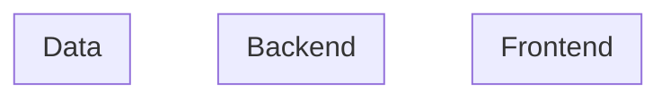

# {{PROJECT_NAME}} - Discovery

**作成日**: {{DATE}}

---

## 1. Show the Solution（技術アーキテクチャ概要）

### アーキテクチャ概要図

<!-- Mermaid or ASCII で概要図を描く -->

### 技術選定

| レイヤー | 選定技術 | 選定理由 | Type 1/2 |
|---------|---------|---------|----------|
| 言語 | | | |
| フレームワーク | | | |
| データベース | | | |
| インフラ | | | |
| 認証 | | | |
| CI/CD | | | |

### 制約・前提条件

- 使用必須の技術:
- 使用禁止の技術:
- 既存システム連携:

---

## 2. Pre-mortem（リスク洗い出し）

<!-- 「このプロジェクトは見事に失敗しました。何が原因？」 -->

| # | リスク | カテゴリ | 発生確率 | 影響度 | 軽減策 |
|---|--------|---------|---------|--------|--------|
| 1 | | 技術/ビジネス/チーム/外部 | 高/中/低 | 高/中/低 | |
| 2 | | | | | |
| 3 | | | | | |

---

## 3. Type 1 決定（不可逆な決定）

<!-- 慎重に検討が必要な不可逆決定をリストアップ -->

| # | 決定事項 | 選択肢 | 推奨 | 根拠 |
|---|---------|--------|------|------|
| 1 | | | | |

---

## 4. Sprint 0 決定事項

### 必須（Sprint 0 で確定）

- [ ] 言語/ランタイム:
- [ ] 主要フレームワーク:
- [ ] リポジトリ構成（Mono/Multi）:
- [ ] CI/CD 骨格:
- [ ] デプロイ先:
- [ ] 認証方式:
- [ ] コーディング規約（Linter/Formatter）:

### Sprint 1-2 で決定

- [ ] DB 製品:
- [ ] キャッシュ戦略:
- [ ] ログ/監視:
- [ ] エラーハンドリング方針:

---

## 5. 非機能要件

### 性能
- 許容レスポンスタイム:
- 同時ユーザー数:
- データ量:

### 可用性
- SLA 目標:
- ダウンタイム許容:

### セキュリティ
- 認証・認可:
- データ保護:
- コンプライアンス:

### スケーラビリティ
- 初期ユーザー数:
- 1年後の見込み:

---

## 6. 回答サマリ

**確定事項**:
-

**未確定・要検討事項**:
-

**次のアクション**: Roadmap 策定 → `/spec init-project` の Step 4 へ進む
