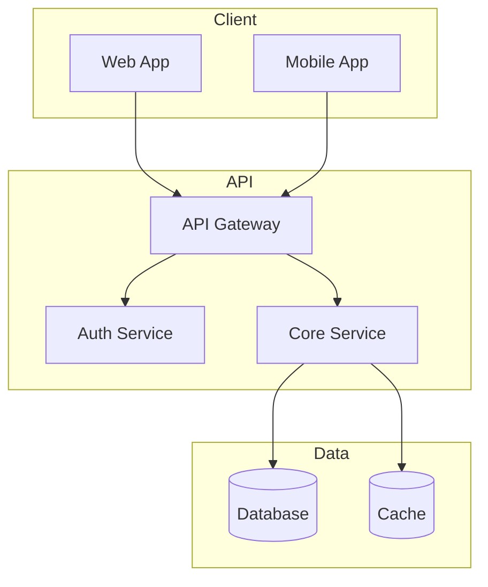

# プロジェクトコンテキスト / Project Context

**最終更新日**: {{DATE}}
**バージョン**: 1.0

---

## 1. 概要 / Overview

<!-- プロジェクトの目的と背景を簡潔に記述 -->

### 1.1 プロジェクト名
{{PROJECT_NAME}}

### 1.2 目的
<!-- このプロジェクトが解決する問題、提供する価値 -->

### 1.3 スコープ
<!-- 対象範囲と非対象範囲 -->

---

## 2. 技術スタック / Tech Stack

### 2.1 言語・フレームワーク

| カテゴリ | 技術 | バージョン |
|:---|:---|:---|
| 言語 | | |
| フレームワーク | | |
| DB | | |
| キャッシュ | | |
| メッセージング | | |

### 2.2 インフラ

| カテゴリ | 技術 |
|:---|:---|
| コンテナ | |
| オーケストレーション | |
| CI/CD | |
| モニタリング | |

### 2.3 開発ツール

| 用途 | ツール |
|:---|:---|
| パッケージマネージャ | |
| タスクランナー | |
| リンター | |
| テスト | |

---

## 3. アーキテクチャ概要 / Architecture Overview



---

## 4. ディレクトリ構造 / Directory Structure

```
/
├── src/                    # ソースコード
├── tests/                  # テストコード
├── docs/                   # ドキュメント
├── specs/                  # 仕様書
│   ├── 00_CONTEXT.md       # このファイル
│   ├── 01_DOMAIN.md        # ドメインモデル
│   ├── 02_SYSTEM_RULES.md  # システムルール
│   ├── 03_USE_CASES.md     # ユースケース
│   ├── 04_API.md           # API設計規約
│   ├── 05_ARCHITECTURE.md  # アーキテクチャ
│   ├── 06_TEST_STRATEGY.md # テスト戦略
│   ├── 07_OPERATIONS.md    # 運用・デプロイ
│   ├── 08_DEV_GUIDELINES.md # 開発ガイドライン
│   └── features/           # 機能単位仕様
└── ...
```

---

## 5. 関連文書 / Related Documents

| 文書 | パス | 説明 |
|:---|:---|:---|
| README | `/README.md` | プロジェクト概要 |
| AGENTS | `/AGENTS.md` | AI Agent開発ルール |
| ドメインモデル | `/specs/01_DOMAIN.md` | エンティティ定義 |
| システムルール | `/specs/02_SYSTEM_RULES.md` | NFR/制約 |
| ユースケース | `/specs/03_USE_CASES.md` | UC一覧 |
| API設計規約 | `/specs/04_API.md` | OpenAPI補完 |
| アーキテクチャ | `/specs/05_ARCHITECTURE.md` | 設計指針 |
| テスト戦略 | `/specs/06_TEST_STRATEGY.md` | テスト方針 |
| 運用・デプロイ | `/specs/07_OPERATIONS.md` | 運用手順 |
| 開発ガイドライン | `/specs/08_DEV_GUIDELINES.md` | コーディング規約 |

---

## 6. 用語集 / Glossary

| 用語 | 定義 |
|:---|:---|
| | |
| | |

---

**更新履歴**:
- {{DATE}}: 初版作成
