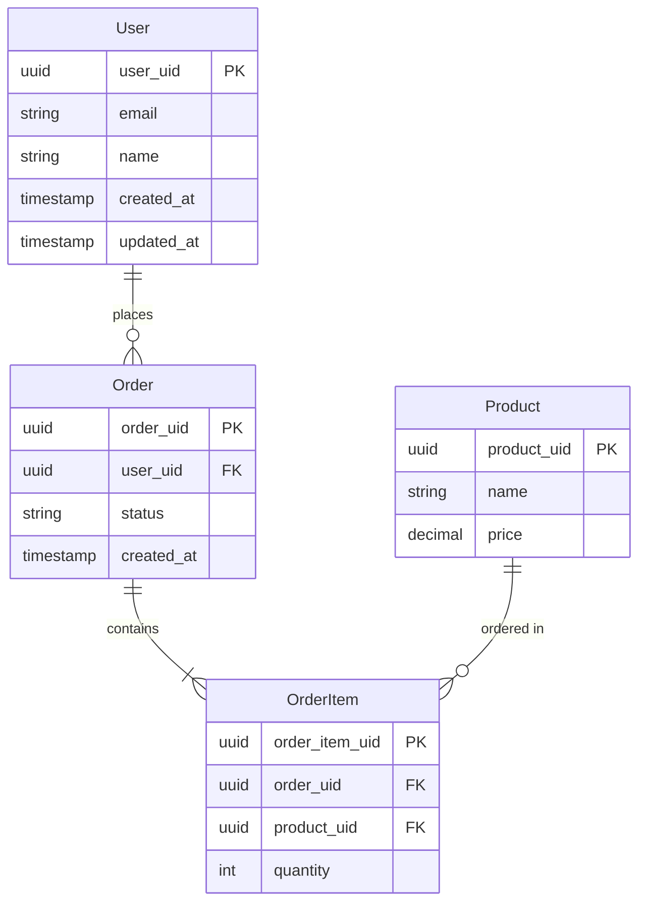

# ドメインモデル / Domain Model

**最終更新日**: {{DATE}}

---

## 1. エンティティ関係図 / Entity Relationship Diagram

---

## 2. エンティティ定義 / Entity Definitions

### 2.1 User

| フィールド | 型 | 必須 | 説明 |
|:---|:---|:---:|:---|
| user_uid | UUID | ○ | 主キー |
| email | string | ○ | メールアドレス（一意） |
| name | string | ○ | 表示名 |
| created_at | timestamp | ○ | 作成日時 |
| updated_at | timestamp | ○ | 更新日時 |

**制約:**
- email は一意
- name は 1-100 文字

---

### 2.2 [エンティティ名]

| フィールド | 型 | 必須 | 説明 |
|:---|:---|:---:|:---|
| | | | |

**制約:**
-

---

## 3. 値オブジェクト / Value Objects

### 3.1 [値オブジェクト名]

| フィールド | 型 | 説明 |
|:---|:---|:---|
| | | |

---

## 4. ドメインイベント / Domain Events

| イベント | トリガー | ペイロード |
|:---|:---|:---|
| UserCreated | ユーザー作成時 | user_uid, email |
| OrderPlaced | 注文確定時 | order_uid, user_uid, items |

---

## 5. 集約 / Aggregates

| 集約ルート | 含まれるエンティティ | 不変条件 |
|:---|:---|:---|
| Order | OrderItem | 合計金額 >= 0 |

---

**更新履歴**:
- {{DATE}}: 初版作成
