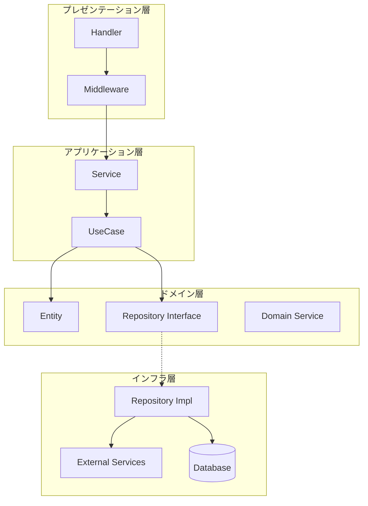
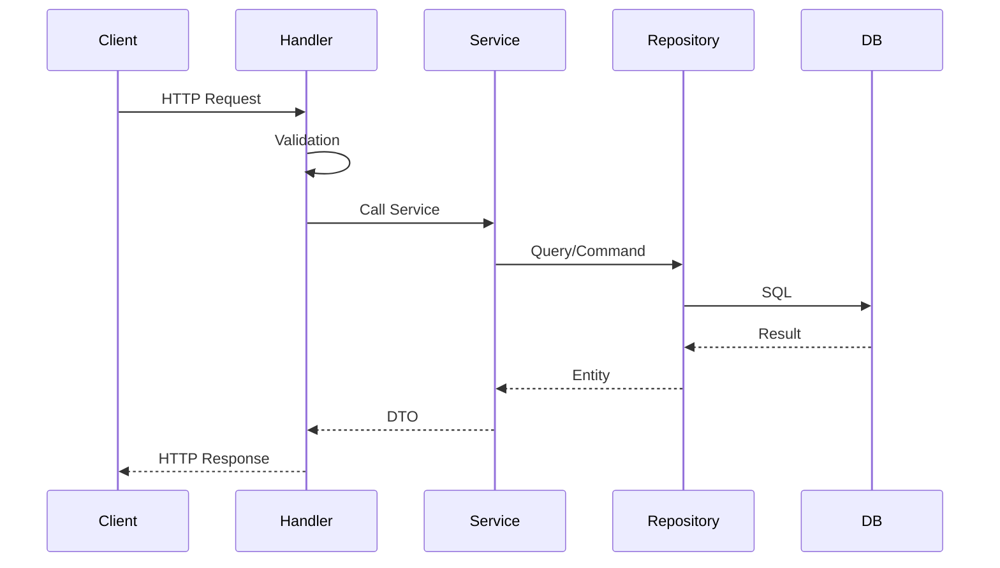
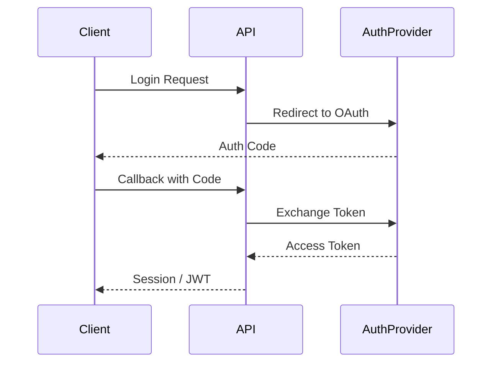

# アーキテクチャ / Architecture

**最終更新日**: {{DATE}}

---

## 1. アーキテクチャ概要 / Overview

### 1.1 アーキテクチャスタイル

<!-- 例: レイヤードアーキテクチャ、クリーンアーキテクチャ、マイクロサービス -->

### 1.2 設計原則

- **SOLID原則**: 単一責任、オープン・クローズド、リスコフ置換、インターフェース分離、依存性逆転
- **DRY**: 重複を避ける
- **KISS**: シンプルに保つ
- **YAGNI**: 必要になるまで実装しない

---

## 2. レイヤー構造 / Layer Structure



### 2.1 各層の責務

| 層 | 責務 | 依存先 |
|:---|:---|:---|
| Presentation | HTTPリクエスト処理、バリデーション | Application |
| Application | ユースケース実行、トランザクション管理 | Domain |
| Domain | ビジネスロジック、エンティティ | なし |
| Infrastructure | データ永続化、外部サービス連携 | Domain（インターフェース） |

---

## 3. ディレクトリ構造 / Directory Structure

```
src/
├── handler/            # プレゼンテーション層
│   ├── middleware/     # ミドルウェア
│   └── v1/             # APIバージョン
│
├── service/            # アプリケーション層
│   └── {domain}/       # ドメイン別サービス
│
├── domain/             # ドメイン層
│   ├── entity/         # エンティティ
│   ├── repository/     # リポジトリインターフェース
│   └── service/        # ドメインサービス
│
├── infrastructure/     # インフラ層
│   ├── repository/     # リポジトリ実装
│   ├── external/       # 外部サービス
│   └── config/         # 設定
│
└── pkg/                # 共通パッケージ
    ├── errors/         # エラー定義
    ├── logger/         # ロガー
    └── utils/          # ユーティリティ
```

---

## 4. API設計 / API Design

### 4.1 RESTful原則

| 原則 | 説明 |
|:---|:---|
| リソース指向 | URLはリソースを表す（動詞ではなく名詞） |
| HTTPメソッド | GET（取得）, POST（作成）, PUT（更新）, DELETE（削除） |
| ステートレス | リクエストは独立して処理可能 |

### 4.2 URL設計

```
GET    /api/v1/{resources}           # 一覧取得
GET    /api/v1/{resources}/{id}      # 詳細取得
POST   /api/v1/{resources}           # 作成
PUT    /api/v1/{resources}/{id}      # 更新
DELETE /api/v1/{resources}/{id}      # 削除
```

### 4.3 レスポンス形式

```json
{
  "status": "success",
  "data": { ... },
  "meta": {
    "page": 1,
    "per_page": 20,
    "total": 100
  }
}
```

### 4.4 エラーレスポンス

```json
{
  "status": "error",
  "error": {
    "code": "VALIDATION_ERROR",
    "message": "入力値が不正です",
    "details": [
      { "field": "email", "message": "メール形式が不正です" }
    ]
  }
}
```

---

## 5. データフロー / Data Flow



---

## 6. 認証・認可 / Authentication & Authorization

### 6.1 認証フロー



### 6.2 認可

| 方式 | 説明 |
|:---|:---|
| RBAC | ロールベースアクセス制御 |
| ABAC | 属性ベースアクセス制御 |

---

## 7. エラーハンドリング / Error Handling

| エラー種別 | HTTPステータス | 対応 |
|:---|:---|:---|
| バリデーションエラー | 400 | 入力修正を促す |
| 認証エラー | 401 | ログインを促す |
| 認可エラー | 403 | 権限不足を通知 |
| リソース未検出 | 404 | 存在しないことを通知 |
| 競合 | 409 | 楽観的ロック失敗等 |
| サーバーエラー | 500 | 汎用エラー |

---

## 8. 横断的関心事 / Cross-Cutting Concerns

### 8.1 ロギング

- 構造化ログ（JSON形式）
- リクエストID付与
- 機密情報マスク

### 8.2 監視

- ヘルスチェックエンドポイント
- メトリクス収集
- 分散トレーシング

### 8.3 キャッシュ

- 読み取り頻度の高いデータ
- TTL設定
- キャッシュ無効化戦略

---

**更新履歴**:
- {{DATE}}: 初版作成
