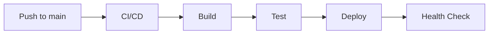

# 運用・デプロイ / Operations & Deployment

**最終更新日**: {{DATE}}

> **Note**: このドキュメントは骨格です。運用経験に応じて拡充してください。

---

## 1. 環境構成 / Environments

| 環境 | 用途 | URL |
|:---|:---|:---|
| Development | ローカル開発 | localhost:3000 |
| Staging | 検証環境 | stg.example.com |
| Production | 本番環境 | example.com |

---

## 2. 環境変数 / Environment Variables

| 変数 | 説明 | 必須 | デフォルト |
|:---|:---|:---:|:---|
| `DATABASE_URL` | DB接続文字列 | ○ | - |
| `PORT` | サーバーポート | - | 3000 |
| `LOG_LEVEL` | ログレベル | - | info |
| `NODE_ENV` | 実行環境 | - | development |

**管理方法:**
- ローカル: `.env` ファイル（.gitignore対象）
- CI/CD: シークレット管理（GitHub Secrets等）
- 本番: 環境変数 or シークレットマネージャー

---

## 3. ローカル開発 / Local Development

### 3.1 セットアップ

```bash
# 依存インストール
task setup  # or npm install

# 環境変数設定
cp .env.example .env

# DB起動（Docker）
task docker:up

# マイグレーション
task db:migrate

# 開発サーバー起動
task dev
```

### 3.2 開発コマンド

| コマンド | 説明 |
|:---|:---|
| `task dev` | 開発サーバー起動 |
| `task build` | ビルド |
| `task lint` | リント |
| `task test` | テスト実行 |
| `task db:migrate` | マイグレーション |
| `task db:seed` | シードデータ投入 |

---

## 4. Docker構成 / Docker

### 4.1 開発用

```yaml
# docker-compose.yml
services:
  db:
    image: postgres:15
    ports:
      - "5432:5432"
    environment:
      POSTGRES_DB: app_dev
      POSTGRES_USER: dev
      POSTGRES_PASSWORD: dev
```

### 4.2 コマンド

| コマンド | 説明 |
|:---|:---|
| `task docker:up` | コンテナ起動 |
| `task docker:down` | コンテナ停止 |
| `task docker:logs` | ログ表示 |

---

## 5. デプロイ / Deployment

### 5.1 デプロイフロー



### 5.2 デプロイ先

| 環境 | プラットフォーム | 方法 |
|:---|:---|:---|
| Staging | <!-- Vercel, Railway, etc --> | 自動デプロイ |
| Production | <!-- AWS, GCP, etc --> | 手動承認後デプロイ |

---

## 6. 監視・ログ / Monitoring & Logging

### 6.1 ヘルスチェック

| エンドポイント | 用途 |
|:---|:---|
| `/health` | 基本ヘルスチェック |
| `/health/ready` | 依存サービス含む |

### 6.2 ログ

| レベル | 用途 |
|:---|:---|
| ERROR | エラー・例外 |
| WARN | 警告 |
| INFO | 重要な操作ログ |
| DEBUG | デバッグ情報 |

### 6.3 監視項目

<!-- 運用経験後に追記 -->
- [ ] レスポンスタイム
- [ ] エラーレート
- [ ] CPU/メモリ使用率
- [ ] DB接続数

---

## 7. バックアップ・復旧 / Backup & Recovery

<!-- 運用経験後に詳細化 -->

| 対象 | 頻度 | 保持期間 |
|:---|:---|:---|
| DB | 日次 | 30日 |
| ファイルストレージ | - | - |

---

## 8. インシデント対応 / Incident Response

<!-- 運用経験後に詳細化 -->

### 8.1 連絡先

| 役割 | 担当 |
|:---|:---|
| オンコール | - |
| エスカレーション | - |

### 8.2 対応フロー

1. 検知・通知
2. 影響範囲確認
3. 一次対応
4. 根本対応
5. ポストモーテム

---

## 9. TODO / 運用経験後に追記

- [ ] 監視ダッシュボード設定
- [ ] アラート閾値設定
- [ ] デプロイロールバック手順
- [ ] 障害対応手順詳細

---

**更新履歴**:
- {{DATE}}: 初版作成（骨格）
