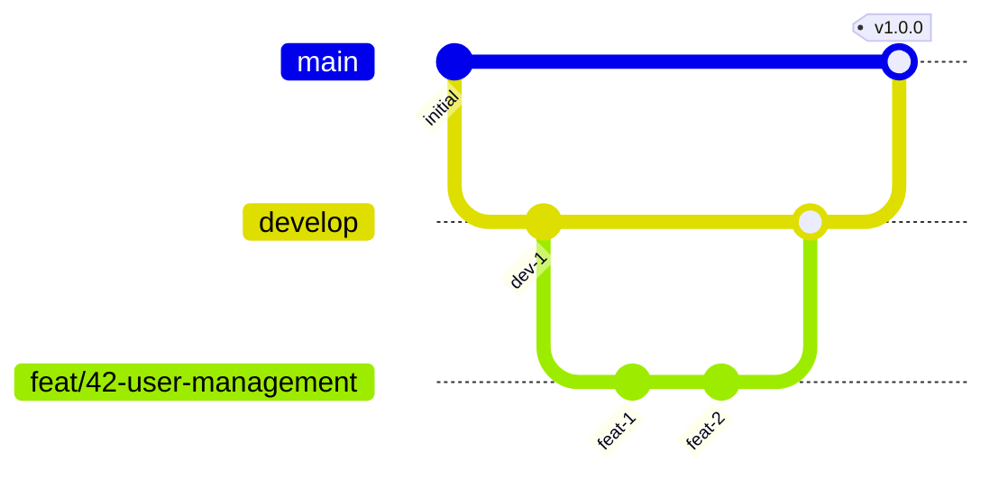
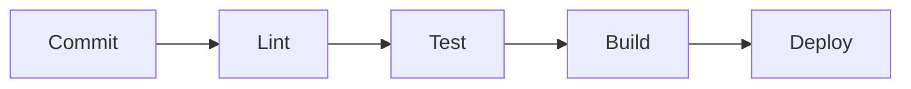

# 開発ガイドライン / Development Guidelines

**最終更新日**: {{DATE}}

---

## 1. コーディング規約 / Coding Standards

### 1.1 命名規則

| 対象 | 規則 | 例 |
|:---|:---|:---|
| ファイル名 | snake_case | `user_service.ts` |
| クラス名 | PascalCase | `UserService` |
| 関数名 | camelCase | `getUserById` |
| 定数 | UPPER_SNAKE_CASE | `MAX_RETRY_COUNT` |
| 変数 | camelCase | `userName` |
| プライベート | _prefix | `_internalMethod` |

### 1.2 フォーマット

- インデント: スペース2つ or 4つ
- 行の最大長: 100文字
- 末尾カンマ: あり
- セミコロン: 言語に応じる

### 1.3 コメント

```typescript
/**
 * ユーザーをIDで取得する
 * @param userId - ユーザーUID
 * @returns ユーザーエンティティ
 * @throws UserNotFoundError - ユーザーが存在しない場合
 */
function getUserById(userId: string): User {
  // ...
}
```

---

## 2. Git運用 / Git Workflow

### 2.1 ブランチ戦略



| ブランチ | 目的 | マージ先 |
|:---|:---|:---|
| `main` | 本番環境 | - |
| `develop` | 開発環境 | `main` |
| `feat/{issue}-{name}` | 機能開発 | `develop` |
| `fix/{issue}-{name}` | バグ修正 | `develop` |
| `hotfix/{issue}-{name}` | 緊急修正 | `main`, `develop` |

### 2.2 コミットメッセージ

```
<type>(<scope>): <subject>

<body>

<footer>
```

**type:**
| type | 説明 |
|:---|:---|
| `feat` | 新機能 |
| `fix` | バグ修正 |
| `docs` | ドキュメント |
| `style` | フォーマット |
| `refactor` | リファクタリング |
| `test` | テスト |
| `chore` | ビルド・設定 |

**例:**
```
feat(user): ユーザー作成APIを追加

- POST /api/v1/users エンドポイント追加
- バリデーション実装
- テスト追加

Refs #42
```

### 2.3 プルリクエスト

- タイトル: `feat(scope): 概要`
- 説明: 変更内容、影響範囲、テスト結果
- レビュアー: 最低1名
- CIパス必須

---

## 3. テスト / Testing

### 3.1 テストピラミッド

```
        /\
       /  \       E2E (少数)
      /----\
     /      \     Integration (中程度)
    /--------\
   /          \   Unit (多数)
  /------------\
```

### 3.2 テスト種別

| 種別 | 対象 | ツール |
|:---|:---|:---|
| Unit | 関数・クラス | Jest, Vitest |
| Integration | API・DB連携 | Supertest |
| E2E | ユーザーフロー | Playwright |

### 3.3 テストファイル配置

```
src/
├── service/
│   └── user_service.ts
└── ...

tests/
├── unit/
│   └── service/
│       └── user_service.test.ts
├── integration/
│   └── api/
│       └── users.test.ts
└── e2e/
    └── user_flow.test.ts
```

### 3.4 テスト命名

```typescript
describe('UserService', () => {
  describe('getUserById', () => {
    it('should return user when user exists', async () => {
      // ...
    });

    it('should throw UserNotFoundError when user does not exist', async () => {
      // ...
    });
  });
});
```

---

## 4. コードレビュー / Code Review

### 4.1 レビュー観点

| 観点 | チェック内容 |
|:---|:---|
| 機能性 | 要件を満たしているか |
| 可読性 | 理解しやすいか |
| 保守性 | 変更しやすいか |
| セキュリティ | 脆弱性がないか |
| パフォーマンス | 効率的か |
| テスト | カバレッジは十分か |

### 4.2 レビューコメント

```markdown
<!-- 必須修正 -->
[MUST] セキュリティリスクがあります。SQLインジェクション対策が必要です。

<!-- 推奨修正 -->
[SHOULD] 可読性向上のため、この処理を別関数に切り出すことを推奨します。

<!-- 提案 -->
[NIT] 変数名を `user` から `targetUser` にすると意図が明確になります。

<!-- 質問 -->
[Q] この実装の意図を教えてください。
```

---

## 5. CI/CD / Continuous Integration & Deployment

### 5.1 CIパイプライン



| ステージ | 内容 | 失敗時 |
|:---|:---|:---|
| Lint | コード品質チェック | マージ不可 |
| Test | 自動テスト実行 | マージ不可 |
| Build | ビルド成功確認 | マージ不可 |
| Deploy | 環境へデプロイ | ロールバック |

### 5.2 環境

| 環境 | ブランチ | URL |
|:---|:---|:---|
| Development | `develop` | dev.example.com |
| Staging | `release/*` | stg.example.com |
| Production | `main` | example.com |

---

## 6. ドキュメント / Documentation

### 6.1 必須ドキュメント

| ドキュメント | 内容 | 更新タイミング |
|:---|:---|:---|
| README | プロジェクト概要 | 初回・大きな変更時 |
| API仕様書 | エンドポイント定義 | API変更時 |
| 仕様書 | 機能仕様 | 機能追加・変更時 |
| CHANGELOG | 変更履歴 | リリース時 |

### 6.2 コード内ドキュメント

- パブリックAPI: JSDoc/GoDoc等で記述
- 複雑なロジック: インラインコメント
- TODO: `// TODO: 説明` 形式

---

## 7. セキュリティ / Security

### 7.1 必須対策

| リスク | 対策 |
|:---|:---|
| SQLインジェクション | パラメータバインド |
| XSS | エスケープ処理 |
| CSRF | トークン検証 |
| 機密情報漏洩 | 環境変数管理 |
| 依存脆弱性 | 定期更新 |

### 7.2 禁止事項

- 機密情報のハードコード
- 本番データのローカル保存
- 暗号化されていない通信
- 不要な権限の付与

---

**更新履歴**:
- {{DATE}}: 初版作成
