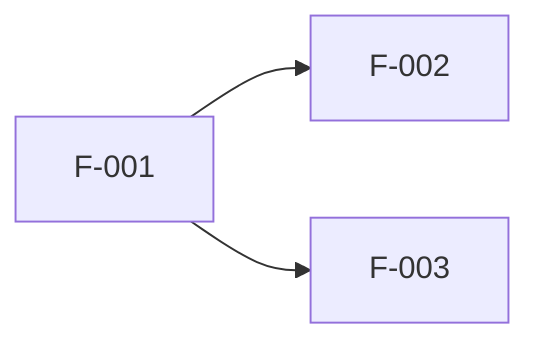

# {{PROJECT_NAME}} - ROADMAP

**作成日**: {{DATE}}
**ステータス**: Draft | Approved

---

## Elevator Pitch

<!-- inception.md から転記 -->

---

## Impact Map

<!-- Goal → Actors → Impacts → Deliverables で機能を論理的に導出 -->

```
Goal: {{ビジネスゴール（SMART）}}
├── {{Actor 1}}
│   ├── {{Impact 1}} → {{Deliverable A}}, {{Deliverable B}}
│   └── {{Impact 2}} → {{Deliverable C}}
└── {{Actor 2}}
    └── {{Impact 3}} → {{Deliverable D}}
```

---

## Feature DAG（依存関係グラフ）



### 依存関係テーブル

<!-- parse-dag.sh がこのテーブルをパースする。フォーマット厳守 -->
<!-- depends_on: カンマ区切り（例: F-001, F-003）。なし の場合は依存なし -->

| ID | Feature | スラッグ | depends_on | 共有リソース | 規模 | 概要 |
|----|---------|---------|------------|-------------|------|------|
| F-001 | | | なし | | M | |
| F-002 | | | F-001 | | S | |

---

## Wave 分割（自動計算）

<!-- parse-dag.sh の出力をここに貼り付け -->

### Wave 1（依存なし）

| Feature | 規模 | リスク |
|---------|------|--------|
| | | |

### Wave 2

| Feature | 依存先 | 規模 | リスク |
|---------|--------|------|--------|
| | | | |

---

## 並列実行計画

```
時間軸 →

Wave 1:  [====== F-001 ======]
                                ↓ merge
Wave 2:  ...................... [== F-002 ==]
```

**推定並列度**: max {{MAX_PARALLEL}}

---

## Trade-off Sliders

<!-- inception.md から転記 -->

| 制約 | ランク (1-4) | 備考 |
|------|-------------|------|
| Scope | | |
| Time | | |
| Budget | | |
| Quality | | |

---

## リスクサマリ

<!-- discovery.md の Pre-mortem から高リスク項目を転記 -->

| リスク | 発生確率 | 影響度 | 軽減策 |
|--------|---------|--------|--------|
| | | | |

---

## 次のアクション

承認後、Phase B（Wave ベース並列実装）を開始:

```bash
/spec go-project
```
