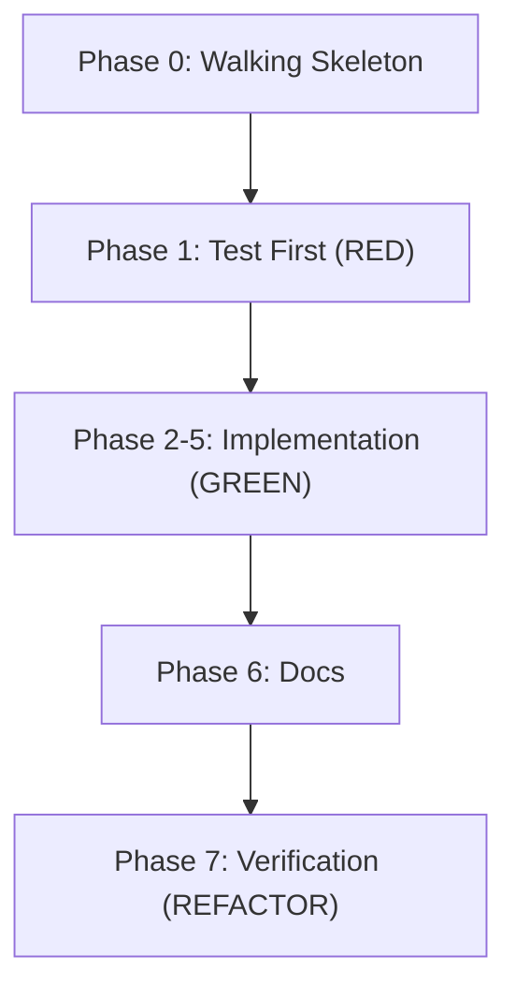
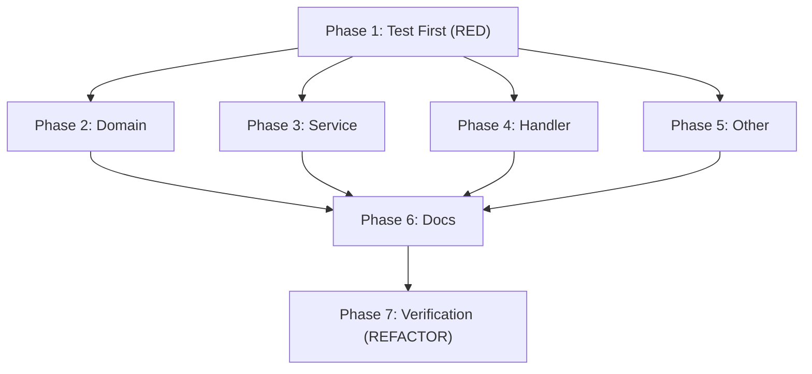

# タスク一覧: {{FEATURE_NAME}}

**Issue**: #{{ISSUE_NUMBER}}
**更新日**: {{DATE}}
**ステータス**: Draft

---

## タスク分解方式

<!-- どちらかを選択してコメントアウトを外す -->

### 方式A: Walking Skeleton（推奨：新機能、不確実性が高い場合）
> 最小限の End-to-End を先に実装し、アーキテクチャを検証してから詳細化

### 方式B: Layer-by-Layer（既存パターンが確立している場合）
> Domain → Service → Handler と段階的に実装

---

## Phase 0: Walking Skeleton（任意）

<!-- 不確実性が高い場合はこのPhaseから開始 -->

- [ ] **TASK-{{ISSUE_NUMBER}}-000**: 最小 E2E 実装
  - 目的: アーキテクチャ検証、技術リスク低減
  - 含める: 最小限の UI/API → Service → Repository → DB
  - 含めない: バリデーション、エラーハンドリング、テスト
  - _Type 1 決定を含む場合は先に ADR 作成_
  - _Requirements: 全体_

---

## Phase 1: テストコード作成 / Test First (TDD: RED)

- [ ] **TASK-{{ISSUE_NUMBER}}-001**: テストコード作成
  - test-spec.md に基づきテストファイルを作成
  - この時点で全テストが FAIL することを確認（RED 状態）
  - テストには具体的な期待値を含める（test-spec.md の値をそのまま使用）
  - _Requirements: 全体_
  - コミット: `feat:{{ISSUE_NUMBER}}_Phase1_テストコード作成`

---

## Phase 2: ドメイン層 / Domain Layer (TDD: GREEN)

- [ ] **TASK-{{ISSUE_NUMBER}}-002**: [タスク名]
  - [詳細説明]
  - テスト実行: Phase 1 のテストが通ることを確認
  - テスト修正禁止（仕様バグ発見時のみ許可、理由を test-spec.md に記録）
  - _Requirements: x.x_
  - _並列可能: Yes/No_
  - コミット: `feat:{{ISSUE_NUMBER}}_Phase2_Domain層実装`

---

## Phase 3: サービス層 / Service Layer (TDD: GREEN)

- [ ] **TASK-{{ISSUE_NUMBER}}-003**: [タスク名]
  - [詳細説明]
  - テスト実行: 関連テストが通ることを確認
  - テスト修正禁止（仕様バグ発見時のみ許可、理由を test-spec.md に記録）
  - _Requirements: x.x_
  - _依存: TASK-{{ISSUE_NUMBER}}-002_
  - コミット: `feat:{{ISSUE_NUMBER}}_Phase3_Service層実装`

---

## Phase 4: ハンドラ層 / Handler Layer (TDD: GREEN)

- [ ] **TASK-{{ISSUE_NUMBER}}-004**: [タスク名]
  - [詳細説明]
  - テスト実行: 関連テストが通ることを確認
  - テスト修正禁止（仕様バグ発見時のみ許可、理由を test-spec.md に記録）
  - _Requirements: x.x_
  - _依存: TASK-{{ISSUE_NUMBER}}-003_
  - コミット: `feat:{{ISSUE_NUMBER}}_Phase4_Handler層実装`

---

## Phase 5: その他実装 / Other Implementation (TDD: GREEN)

- [ ] **TASK-{{ISSUE_NUMBER}}-005**: [タスク名]
  - [詳細説明]
  - テスト実行: 関連テストが通ることを確認
  - テスト修正禁止（仕様バグ発見時のみ許可、理由を test-spec.md に記録）
  - _Requirements: x.x_
  - コミット: `feat:{{ISSUE_NUMBER}}_Phase5_その他実装`

---

## Phase 6: ドキュメント更新 / Documentation

- [ ] **TASK-{{ISSUE_NUMBER}}-006**: SSOT更新
  - specs/03_USE_CASES.md へUC追記
  - specs/04_API.md へエンドポイント追記
  - _Requirements: x.x_
  - コミット: `feat:{{ISSUE_NUMBER}}_Phase6_ドキュメント更新`

---

## Phase 7: 最終検証 / Verification (TDD: REFACTOR)

- [ ] **TASK-{{ISSUE_NUMBER}}-007**: 最終検証
  - 全テスト通過確認
  - テストカバレッジ確認
  - テスト修正履歴の確認（test-spec.md の変更理由が正当か）
  - lint/test 通過確認
  - 動作確認
  - _Requirements: x.x_
  - _依存: Phase 1-6 完了_
  - コミット: `feat:{{ISSUE_NUMBER}}_Phase7_最終検証`

---

## 依存関係 / Dependencies

### 方式A: Walking Skeleton + TDD



### 方式B: Layer-by-Layer + TDD



---

## リスクマーク / Risk Markers

| マーク | 意味 |
|--------|------|
| ⚠️ | Type 1 決定を含む（ADR 必須） |
| 🔴 | 技術的リスク高（Spike 推奨） |
| 🟡 | 外部依存あり |
| 🟢 | 低リスク |

**リスクのあるタスク**:
| タスク | マーク | 理由 |
|--------|--------|------|
| TASK-{{ISSUE_NUMBER}}-xxx | ⚠️ | 新規テーブル追加 |

---

## 工数見積 / Effort Estimation

**見積基準**:
| サイズ | 目安 | 複雑度 |
|--------|------|--------|
| XS | 〜1時間 | 単純な変更 |
| S | 〜2時間 | 既存パターン |
| M | 〜4時間 | 新規実装 |
| L | 〜8時間 | 複雑な実装 |
| XL | 8時間〜 | 要分割検討 |

| Phase | 見積 | タスク数 | 備考 |
|:---|:---|:---|:---|
| Phase 0: Walking Skeleton | - | 0-1 | 任意 |
| Phase 1: Test First | S | 1 | test-spec.md ベース |
| Phase 2: Domain | S | | |
| Phase 3: Service | M | | |
| Phase 4: Handler | S | | |
| Phase 5: Other | S | | |
| Phase 6: Documentation | S | | |
| Phase 7: Verification | XS | | |

**合計見積**: [合計]

---

## テストコマンド参照 / Test Commands

```bash
# 単体テスト
{{TEST_COMMAND_UNIT}}

# 統合テスト
{{TEST_COMMAND_INTEGRATION}}

# E2Eテスト
{{TEST_COMMAND_E2E}}

# 全テスト
{{TEST_COMMAND_ALL}}

# Lint
{{TEST_COMMAND_LINT}}

# 開発サーバー
{{TEST_COMMAND_DEV}}
```

---

## 更新履歴 / History

| 日付 | 内容 |
|:---|:---|
| {{DATE}} | 初版作成 |

---

## 承認 / Approval

**承認する場合:** 「承認」または「OK」と回答してください
**修正が必要な場合:** 修正点を指摘してください
